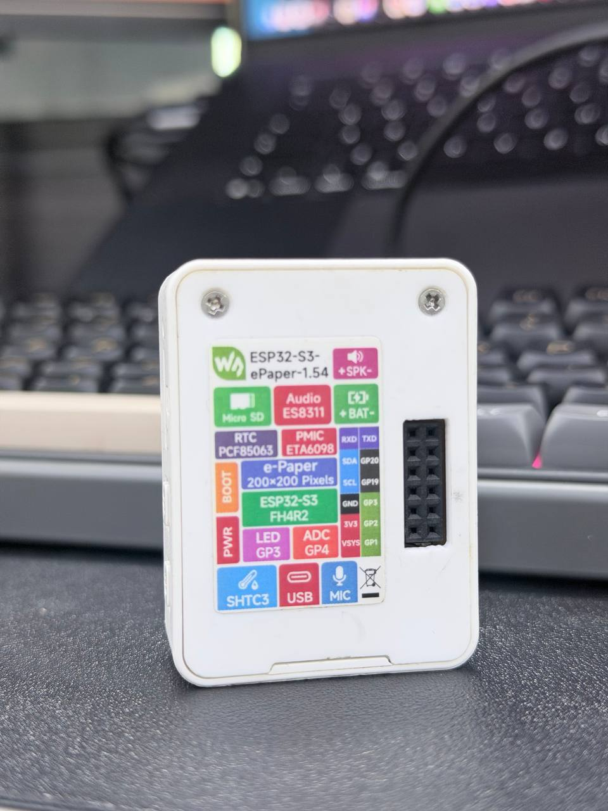

# SIGBIN ESP32-S3 ePaper 1.54

Official release package for the SIGBIN firmware targeting the Waveshare ESP32-S3 ePaper 1.54 board.

<p align="center">
  
  &nbsp;&nbsp;
  
</p>

## Release Status

This release is open for testing. Feedback, bug reports, display photos, and device compatibility notes are welcome.

## Flash Online

Open the web flasher:

```text
https://esp.sigbinlabs.com/
```

Use Chrome, Edge, or another browser that supports Web Serial. Connect the board by USB, select `SIGBIN ESP32-S3 ePaper 1.54`, then press `Connect`.

## Features

- Clean e-paper dashboard designed for the 1.54 inch display.
- Partial-refresh navigation to reduce full-screen flicker after boot.
- `NEARBY` scanner view with a compact table for detected devices.
- WiFi setup portal with saved credentials in device storage.
- Always-available setup AP so WiFi can be changed later.
- BLE status and GPS status indicators.
- Battery and charging status display.
- `SENTRY` overview for WiFi/BLE flock counters and channel activity.
- `OPTIC` view for smart-glass style BLE targets.
- `ROGUE` view for rogue tool detection.
- `TAGHUNT` view for tracker-style detections.
- `HARVEST` view for passive 802.11 capture with live counters and SD card file writing.
- `DEAUTH` view for passive monitoring and sent-frame counters.
- `WPASEC` view for upload, fail, and crack status counters.
- `ENVIRO` view for temperature and humidity.
- Tiny bitmap UI font with punctuation needed for IPs, percentages, and labels.

## HARVEST — Passive WiFi Capture

The `HARVEST` screen arms and disarms passive 802.11 frame capture. No frames are transmitted; the device only listens.

### What it captures

- All 802.11 management frames (beacons, probes, auth, assoc, deauth, disassoc)
- EAPOL data frames (WPA handshakes, PMKIDs)

### What it saves

Frames are written in standard `.pcap` format to the SD card under `/captures/`. Each session creates a timestamped file:

```
/sdcard/captures/cap_YYYYMMDD_HHMMSS.pcap
```

Files can be opened directly in Wireshark or fed to tools like `hcxtools` for offline processing.

### Live counters displayed

| Counter | Meaning |
| --- | --- |
| Packets | Total management + EAPOL frames written to disk |
| EAPOL | Raw EAPOL frames seen |
| Handshakes | WPA 4-way handshakes with at least M1+M2 or M2+M3 captured |
| PMKIDs | PMKID elements extracted from EAPOL M1 frames |
| Deauths | Deauth/disassoc frames observed |

### Channel behaviour

- If the device is connected to a WiFi AP, capture locks to that AP's channel.
- If not connected, the device hops channels 1–13 every 350 ms.

### Deauth attack detection

If 5 or more deauth/disassoc frames are seen within a 5-second window, the `DEAUTH ATCK` indicator activates on the display.

### File lifecycle

- File opens when capture is armed, closes cleanly when disarmed.
- Data is flushed to SD every 10 packets to reduce loss on abrupt power cuts.

## Incoming Features

### Audio Alerts via Onboard Speaker

The board has an ES8311 audio codec and speaker header. Audible beep alerts are planned for:

| Trigger | Alert |
| --- | --- |
| BLE flock detected nearby | Short beep burst |
| Flipper Zero signature detected | Distinct tone pattern |
| Meta smart glasses detected | Distinct tone pattern |

These alerts will fire passively — no user action needed — so the device can be pocketed or bag-mounted and still notify on detections.

## Device Specs

| Item | Spec |
| --- | --- |
| Board | Waveshare ESP32-S3 ePaper 1.54 |
| MCU | ESP32-S3 |
| Display | 1.54 inch e-paper |
| Flash package | Single merged ESP32-S3 binary |
| Flash offset | `0x0` |
| Flash mode | `dio` |
| Flash frequency | `80m` |
| Flash size | `4MB` |
| Setup AP | `SIGBIN-SETUP` |
| Setup AP password | `epaper1234` |
| WiFi setup page | `http://192.168.4.1` |

## First Boot WiFi Setup

After flashing, the device creates the `SIGBIN-SETUP` access point.

1. Connect your phone or laptop to `SIGBIN-SETUP`.
2. Use password `epaper1234`.
3. Open `http://192.168.4.1`.
4. Enter your home WiFi SSID/password.
5. Press `Save and Connect`.

The setup AP stays available, so WiFi can be changed again later.
